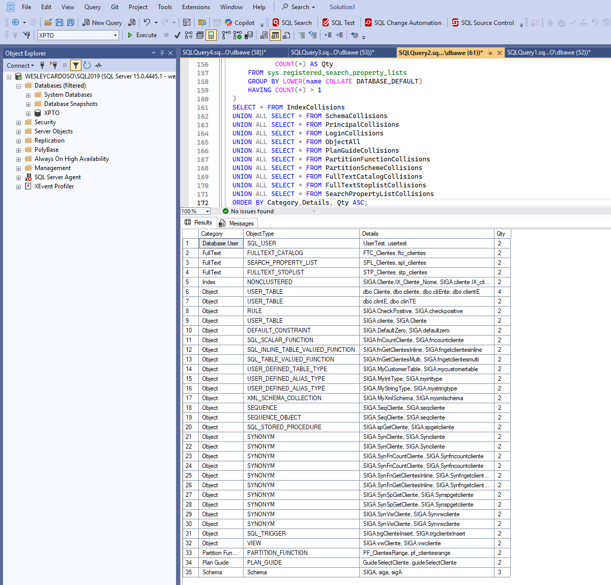

# SQL Server - Detecção de Objetos Duplicados por Nome (Case-Insensitive)

Este script em T-SQL tem como objetivo identificar **objetos duplicados em um banco de dados SQL Server**, considerando diferenças apenas de **maiúsculas e minúsculas** nos nomes (case-insensitive).  

Ele cobre desde **schemas**, **usuários**, **logins**, até **objetos de banco de dados**, **tipos definidos pelo usuário**, **plan guides**, **particionamentos** e **objetos de full-text**.

---

## 🔎 O que o script verifica

O script detecta duplicidades em:

- **Schemas**
- **Database Principals** (usuários de banco)
- **Server Logins** (logins vinculados ao banco)
- **Objetos**:
  - Tabelas
  - Views
  - Procedures
  - Functions
  - Synonyms
  - Sequences
  - User-Defined Data Types (alias types)
  - User-Defined Table Types
  - User-Defined CLR Types (via assemblies)
  - XML Schema Collections
- **Índices**
- **Plan Guides**
- **Partition Functions**
- **Partition Schemes**
- **Full-Text**:
  - Catálogos (`Fulltext Catalogs`)
  - Stoplists (`Fulltext Stoplists`)
  - Search Property Lists (`Search Property Lists`)

---

## 📋 Estrutura do Resultado

A consulta final retorna os seguintes campos:

- **Category** → Categoria do objeto (ex.: `Schema`, `Object`, `Index`, `Plan Guide`, `FullText`)
- **ObjectType** → Tipo específico do objeto (ex.: `USER_DEFINED_TABLE_TYPE`, `SEQUENCE`, `FULLTEXT_CATALOG`)
- **Details** → Lista de nomes dos objetos duplicados (ex.: `dbo.Cliente, dbo.cliente`)
- **Qty** → Quantidade de duplicidades encontradas

---


## 🚀 Como utilizar

1. Conecte-se ao **SQL Server Management Studio (SSMS)** ou outra ferramenta de query.
2. Selecione o banco de dados que deseja analisar:
```sql
USE [NomeDoBanco];
;WITH SchemaCollisions AS (
    SELECT 'Schema' AS Category, 'Schema' AS ObjectType,
           STRING_AGG(name COLLATE DATABASE_DEFAULT, ', ') COLLATE DATABASE_DEFAULT AS Details,
           COUNT(*) AS Qty
    FROM sys.schemas
    GROUP BY LOWER(name COLLATE DATABASE_DEFAULT)
    HAVING COUNT(*) > 1
),
PrincipalCollisions AS (
    SELECT 'Database User' AS Category, type_desc AS ObjectType,
           STRING_AGG(name COLLATE DATABASE_DEFAULT, ', ') COLLATE DATABASE_DEFAULT AS Details,
           COUNT(*) AS Qty
    FROM sys.database_principals
    WHERE type NOT IN ('R','A')
    GROUP BY LOWER(name COLLATE DATABASE_DEFAULT), type_desc
    HAVING COUNT(*) > 1
),
LoginCollisions AS (
    SELECT 'Server Login' AS Category, sp.type_desc AS ObjectType,
           STRING_AGG(sp.name COLLATE DATABASE_DEFAULT, ', ') COLLATE DATABASE_DEFAULT AS Details,
           COUNT(*) AS Qty
    FROM sys.database_principals dp
    JOIN sys.server_principals sp ON dp.sid = sp.sid
    WHERE dp.type NOT IN ('R','A') AND sp.type NOT IN ('R','A')
    GROUP BY LOWER(sp.name COLLATE DATABASE_DEFAULT), sp.type_desc
    HAVING COUNT(*) > 1
),
ObjectAll AS (
    -- Objetos normais (tabelas, views, procedures etc.)
    SELECT 'Object' AS Category, o.type_desc AS ObjectType,
           STRING_AGG(s.name COLLATE DATABASE_DEFAULT + '.' + o.name COLLATE DATABASE_DEFAULT, ', ') COLLATE DATABASE_DEFAULT AS Details,
           COUNT(*) AS Qty
    FROM sys.objects o
    JOIN sys.schemas s ON o.schema_id = s.schema_id
    WHERE o.is_ms_shipped = 0
    GROUP BY LOWER(s.name COLLATE DATABASE_DEFAULT), LOWER(o.name COLLATE DATABASE_DEFAULT), o.type_desc
    HAVING COUNT(*) > 1

    UNION ALL
    -- Synonyms
    SELECT 'Object','SYNONYM',
           STRING_AGG(s.name COLLATE DATABASE_DEFAULT + '.' + syn.name COLLATE DATABASE_DEFAULT, ', ') COLLATE DATABASE_DEFAULT AS Details,
           COUNT(*) AS Qty
    FROM sys.synonyms syn
    JOIN sys.schemas s ON syn.schema_id = s.schema_id
    GROUP BY LOWER(syn.name COLLATE DATABASE_DEFAULT)
    HAVING COUNT(*) > 1

    UNION ALL
    -- Sequences
    SELECT 'Object','SEQUENCE',
           STRING_AGG(s.name COLLATE DATABASE_DEFAULT + '.' + seq.name COLLATE DATABASE_DEFAULT, ', ') COLLATE DATABASE_DEFAULT AS Details,
           COUNT(*) AS Qty
    FROM sys.sequences seq
    JOIN sys.schemas s ON seq.schema_id = s.schema_id
    GROUP BY LOWER(s.name COLLATE DATABASE_DEFAULT), LOWER(seq.name COLLATE DATABASE_DEFAULT)
    HAVING COUNT(*) > 1

    UNION ALL
    -- Alias types (User-Defined Data Types criados como alias de built-in types)
    SELECT 'Object','USER_DEFINED_ALIAS_TYPE',
           STRING_AGG(s.name COLLATE DATABASE_DEFAULT + '.' + t.name COLLATE DATABASE_DEFAULT, ', ') COLLATE DATABASE_DEFAULT AS Details,
           COUNT(*) AS Qty
    FROM sys.types t
    JOIN sys.schemas s ON t.schema_id = s.schema_id
    WHERE t.is_user_defined = 1 AND t.is_table_type = 0 AND t.is_assembly_type = 0
    GROUP BY LOWER(s.name COLLATE DATABASE_DEFAULT), LOWER(t.name COLLATE DATABASE_DEFAULT)
    HAVING COUNT(*) > 1

    UNION ALL
    -- Table Types
    SELECT 'Object','USER_DEFINED_TABLE_TYPE',
           STRING_AGG(s.name COLLATE DATABASE_DEFAULT + '.' + t.name COLLATE DATABASE_DEFAULT, ', ') COLLATE DATABASE_DEFAULT AS Details,
           COUNT(*) AS Qty
    FROM sys.types t
    JOIN sys.schemas s ON t.schema_id = s.schema_id
    WHERE t.is_table_type = 1
    GROUP BY LOWER(s.name COLLATE DATABASE_DEFAULT), LOWER(t.name COLLATE DATABASE_DEFAULT)
    HAVING COUNT(*) > 1

    UNION ALL
    -- CLR User-Defined Types (Assembly Types)
    SELECT 'Object','USER_DEFINED_CLR_TYPE',
           STRING_AGG(s.name COLLATE DATABASE_DEFAULT + '.' + t.name COLLATE DATABASE_DEFAULT, ', ') COLLATE DATABASE_DEFAULT AS Details,
           COUNT(*) AS Qty
    FROM sys.types t
    JOIN sys.schemas s ON t.schema_id = s.schema_id
    WHERE t.is_assembly_type = 1
    GROUP BY LOWER(s.name COLLATE DATABASE_DEFAULT), LOWER(t.name COLLATE DATABASE_DEFAULT)
    HAVING COUNT(*) > 1

    UNION ALL
    -- XML Schema Collections
    SELECT 'Object','XML_SCHEMA_COLLECTION',
           STRING_AGG(s.name COLLATE DATABASE_DEFAULT + '.' + xsc.name COLLATE DATABASE_DEFAULT, ', ') COLLATE DATABASE_DEFAULT AS Details,
           COUNT(*) AS Qty
    FROM sys.xml_schema_collections xsc
    JOIN sys.schemas s ON xsc.schema_id = s.schema_id
    GROUP BY LOWER(s.name COLLATE DATABASE_DEFAULT), LOWER(xsc.name COLLATE DATABASE_DEFAULT)
    HAVING COUNT(*) > 1
),
IndexCollisions AS (
    SELECT 'Index' AS Category, i.type_desc AS ObjectType,
           STRING_AGG(s.name COLLATE DATABASE_DEFAULT + '.' + o.name COLLATE DATABASE_DEFAULT + '.' + i.name COLLATE DATABASE_DEFAULT, ', ') COLLATE DATABASE_DEFAULT AS Details,
           COUNT(*) AS Qty
    FROM sys.indexes i
    JOIN sys.objects o ON i.object_id = o.object_id
    JOIN sys.schemas s ON o.schema_id = s.schema_id
    WHERE o.is_ms_shipped = 0 AND i.name IS NOT NULL
    GROUP BY LOWER(s.name COLLATE DATABASE_DEFAULT), LOWER(o.name COLLATE DATABASE_DEFAULT), LOWER(i.name COLLATE DATABASE_DEFAULT), i.type_desc
    HAVING COUNT(*) > 1
),
PlanGuideCollisions AS (
    SELECT 'Plan Guide' AS Category, 'PLAN_GUIDE' AS ObjectType,
           STRING_AGG(name COLLATE DATABASE_DEFAULT, ', ') COLLATE DATABASE_DEFAULT AS Details,
           COUNT(*) AS Qty
    FROM sys.plan_guides
    GROUP BY LOWER(name COLLATE DATABASE_DEFAULT)
    HAVING COUNT(*) > 1
),
PartitionFunctionCollisions AS (
    SELECT 'Partition Function' AS Category, 'PARTITION_FUNCTION' AS ObjectType,
           STRING_AGG(name COLLATE DATABASE_DEFAULT, ', ') COLLATE DATABASE_DEFAULT AS Details,
           COUNT(*) AS Qty
    FROM sys.partition_functions
    GROUP BY LOWER(name COLLATE DATABASE_DEFAULT)
    HAVING COUNT(*) > 1
),
PartitionSchemeCollisions AS (
    SELECT 'Partition Scheme' AS Category, 'PARTITION_SCHEME' AS ObjectType,
           STRING_AGG(name COLLATE DATABASE_DEFAULT, ', ') COLLATE DATABASE_DEFAULT AS Details,
           COUNT(*) AS Qty
    FROM sys.partition_schemes
    GROUP BY LOWER(name COLLATE DATABASE_DEFAULT)
    HAVING COUNT(*) > 1
),
FullTextCatalogCollisions AS (
    SELECT 'FullText' AS Category, 'FULLTEXT_CATALOG' AS ObjectType,
           STRING_AGG(name COLLATE DATABASE_DEFAULT, ', ') COLLATE DATABASE_DEFAULT AS Details,
           COUNT(*) AS Qty
    FROM sys.fulltext_catalogs
    GROUP BY LOWER(name COLLATE DATABASE_DEFAULT)
    HAVING COUNT(*) > 1
),
FullTextStoplistCollisions AS (
    SELECT 'FullText' AS Category, 'FULLTEXT_STOPLIST' AS ObjectType,
           STRING_AGG(name COLLATE DATABASE_DEFAULT, ', ') COLLATE DATABASE_DEFAULT AS Details,
           COUNT(*) AS Qty
    FROM sys.fulltext_stoplists
    GROUP BY LOWER(name COLLATE DATABASE_DEFAULT)
    HAVING COUNT(*) > 1
),
SearchPropertyListCollisions AS (
    SELECT 'FullText' AS Category, 'SEARCH_PROPERTY_LIST' AS ObjectType,
           STRING_AGG(name COLLATE DATABASE_DEFAULT, ', ') COLLATE DATABASE_DEFAULT AS Details,
           COUNT(*) AS Qty
    FROM sys.registered_search_property_lists
    GROUP BY LOWER(name COLLATE DATABASE_DEFAULT)
    HAVING COUNT(*) > 1
)
SELECT * FROM IndexCollisions
UNION ALL SELECT * FROM SchemaCollisions
UNION ALL SELECT * FROM PrincipalCollisions
UNION ALL SELECT * FROM LoginCollisions
UNION ALL SELECT * FROM ObjectAll
UNION ALL SELECT * FROM PlanGuideCollisions
UNION ALL SELECT * FROM PartitionFunctionCollisions
UNION ALL SELECT * FROM PartitionSchemeCollisions
UNION ALL SELECT * FROM FullTextCatalogCollisions
UNION ALL SELECT * FROM FullTextStoplistCollisions
UNION ALL SELECT * FROM SearchPropertyListCollisions
ORDER BY Category,Details, Qty ASC;
```


## Imagem 


> O destaque está no item “Quantidade de duplicidades” na tabela.